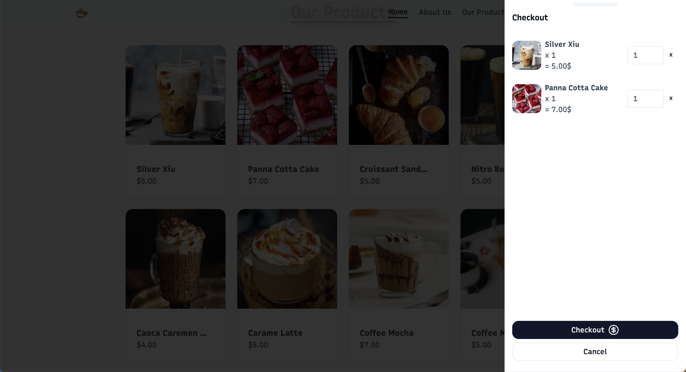
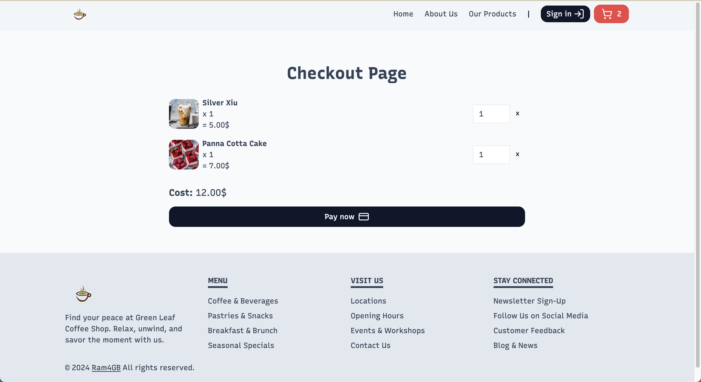
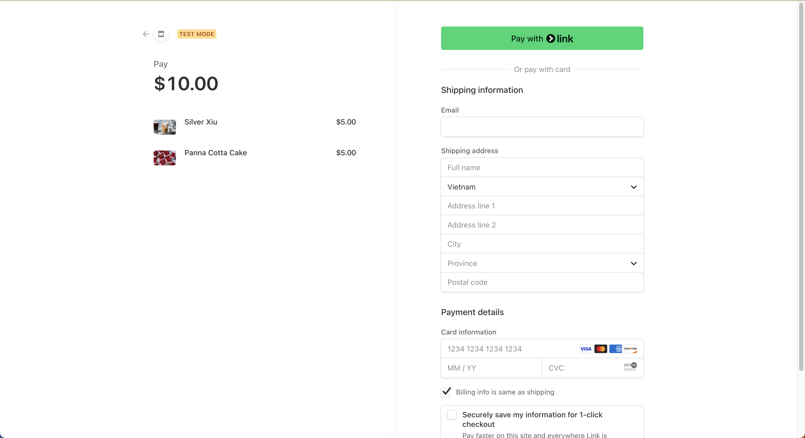
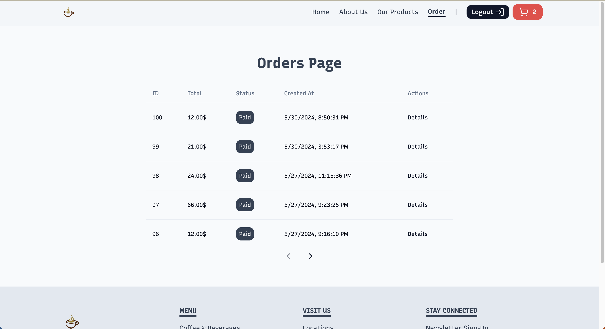

# Small Coffee Shop

This workspace appears to be for a small coffee shop web application built with Next.js and styled with Tailwind CSS.

## Getting Started

First, run the development server:

```bash
npm run dev
```

## Image

### Full page


### Cart drawer



### Checkout page



### Stripe payment



### Order page (Login only)



Open [http://localhost:3000](http://localhost:3000) with your browser to see the result.

## Project Structure

The project has the following structure:

- `.next/`: Contains the built output of your Next.js application.
- `src/`: Contains the source code of the application.
- `public/`: Contains static assets like images.
- `tailwind.config.ts`: Configuration file for Tailwind CSS.
- `next.config.mjs`: Configuration file for Next.js.
- `postcss.config.mjs`: Configuration file for PostCSS.
- `database.types.ts`: Contains type definitions for the database.

## Tailwind CSS

This project uses Tailwind CSS for styling. You can find the configuration in `.vscode/tailwind.json`.

## Deployment

The easiest way to deploy your Next.js app is to use the [Vercel Platform](https://vercel.com/new?utm_medium=default-template&filter=next.js&utm_source=create-next-app&utm_campaign=create-next-app-readme) from the creators of Next.js.

Check out our [Next.js deployment documentation](https://nextjs.org/docs/deployment) for more details.
